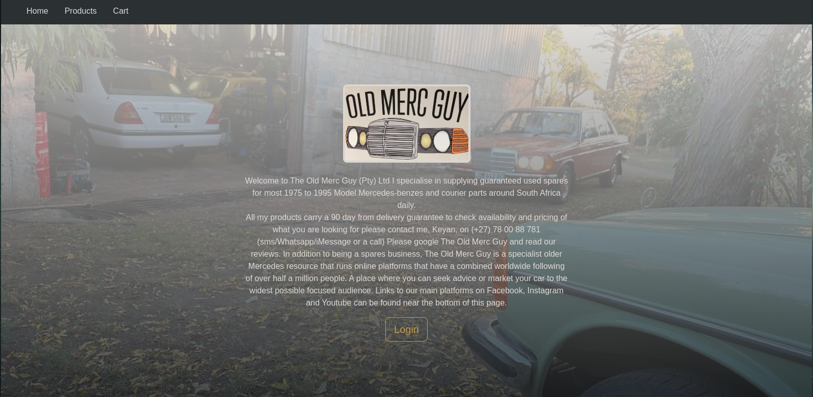
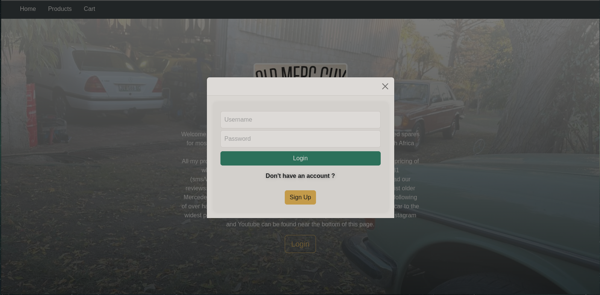
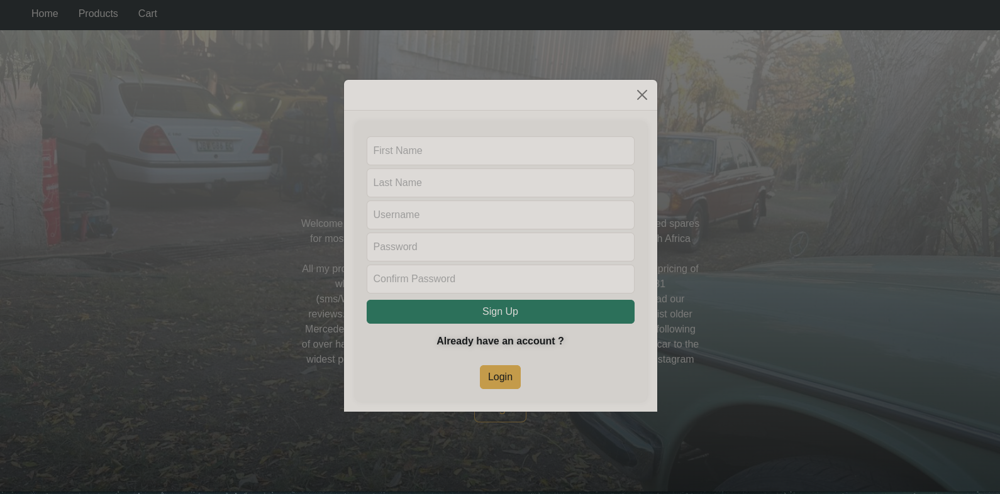
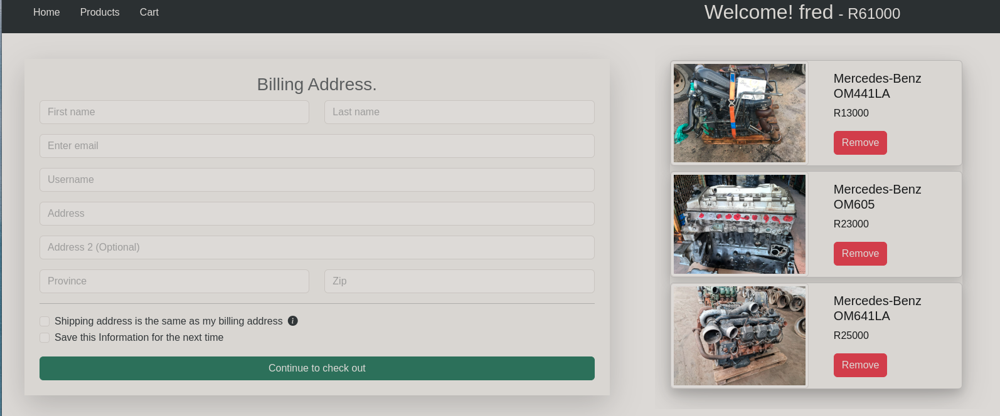

# **Web Store : Old Merc Guy**

# **Project Description**

This is mock web store where users can buy engines.
Users can browse the catalog by clicking the products tab.
when an item is selected it will be added to the cart page, where the user can enter all relevant shipping details as well as view the  total and remove unwanted selections.

Users can login by entering a username and password. If the user is not registered they can do so by clicking the sign up button,
doing this will allow the user to see the total amount on the top right hand corner.

# The technologies used in this projects are as follows:
* React.js
* Bootstrap
* CSS
* formik: form validation

# **How to Install and Run The Web Store**

To launch the application do the following.

* npm install
* npm start
# 
# 
# 
# 
